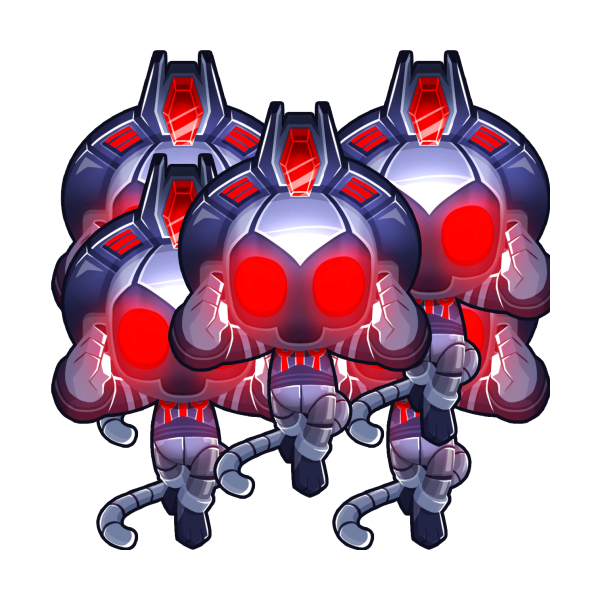
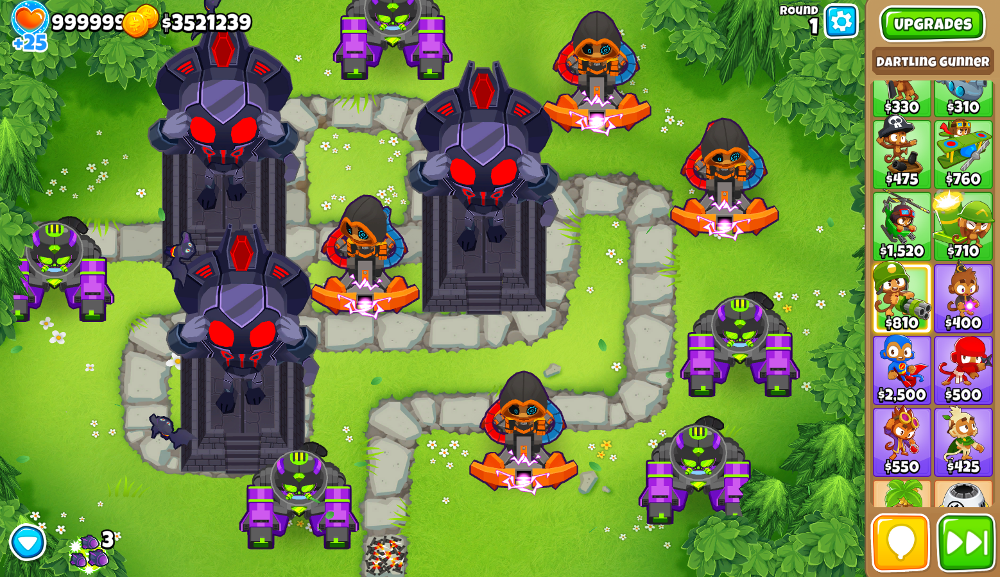

<h1 align="center">Unlimited 5th Tiers +</h1>

### Lets you use any amount of fith tier towers in BTD6, and more

### Features

- Unlimited amount of the same 5th tier tower allowed
- Unlimited amount of the same Paragon tower allowed
- Unlimited amount of Vengeful True Sun Gods allowed
- All of the above naturally usable in Sandbox mode
- True Sun Gods can still become Vengeful even if not fully sacrificed
- 1/1/1/1 and 2/2/2/2 Sacrifices are allowed

## NOTE: This alpha version of the mod requires [BTD6 Mod Helper >v3.0](https://github.com/gurrenm3/BTD-Mod-Helper/wiki/Mod-Helper-3.0-Alpha), see [here](https://github.com/doombubbles/BTD6-Mods#readme) for the stable mods

